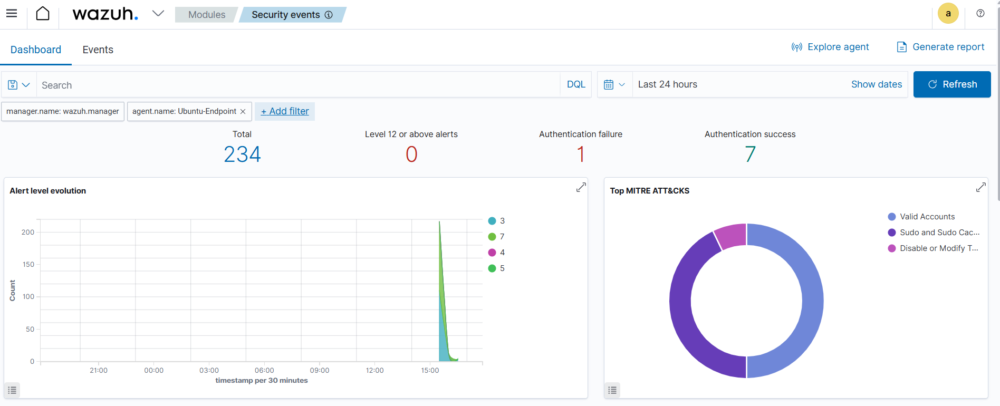
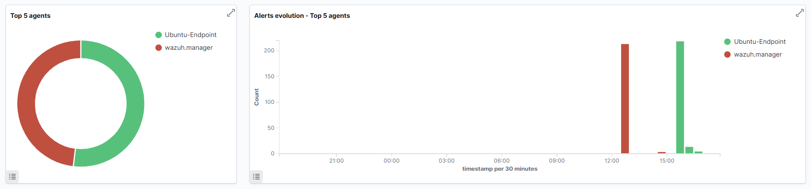
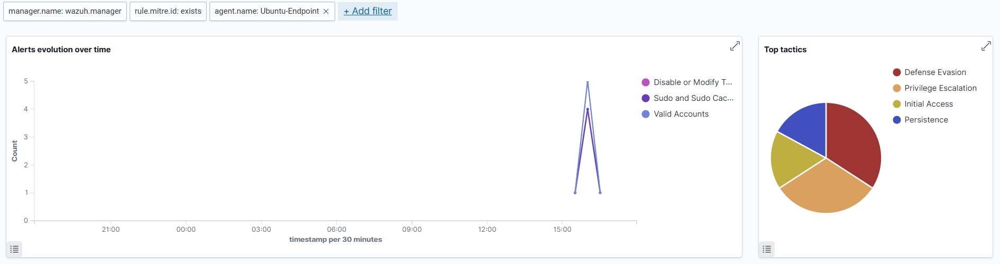
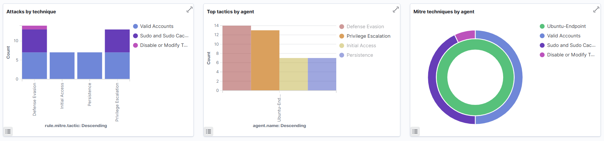

# Implementation of EDR Threat Hunting & Incident Response System

## Objective
Set up a complete environment for Wazuh (XDR/EDR + SIEM) with Docker, network configuration, and endpoint pairing for real-time threat monitoring and hunting.

---

## System Architecture

| Component         | IP              | Role                     |
|------------------|------------------|--------------------------|
| Wazuh Manager    | 192.168.0.103    | EDR/SIEM via Docker      |
| Ubuntu Endpoint  | 192.168.0.104    | Wazuh Agent + AtomicRed  |
| Host OS          | —                | VirtualBox/Bridged Mode  |

---

## Step-by-Step Setup

### 1. Install Docker on Wazuh Manager VM

On the Ubuntu VM (`192.168.0.100`):

```bash
sudo apt update && sudo apt install -y \
    docker.io \
    docker-compose \
    apt-transport-https \
    ca-certificates \
    curl \
    software-properties-common

sudo systemctl enable docker
sudo systemctl start docker
```
## 2. Deploy Wazuh Docker Stack


```bash
git clone https://github.com/wazuh/wazuh-docker.git -b v4.7.0
cd wazuh-docker/single-node
sudo docker-compose -f generate-indexer-certs.yml run --rm generator
sudo docker-compose up -d
```

### Access Wazuh Dashboard

URL: `https://192.168.0.100`

Credentials:
```plaintext
Username: admin
Password: (From docker logs or reset manually)
```

---

## 3. Install Wazuh Agent on Endpoint VM

```bash
curl -sO https://packages.wazuh.com/4.7/wazuh-agent_4.7.0-1_amd64.deb
sudo dpkg -i wazuh-agent_4.7.0-1_amd64.deb
```

Configure agent:
```bash
sudo nano /var/ossec/etc/ossec.conf
```
Set:
```xml
<address>192.168.0.103</address>
```

Start agent:
```bash
sudo systemctl enable wazuh-agent
sudo systemctl start wazuh-agent
```

---

## 4. Validate Agent Enrollment

Pair with manager via Web UI or `agent-auth`

From Wazuh Manager Web UI:
- Go to **Agents → Add agent**
- Select OS and copy the enrollment command

Alternatively, use `agent-auth` from terminal:
```bash
sudo /var/ossec/bin/agent-auth -m 192.168.0.100
```

---

## 5. Test Connection

On Wazuh Dashboard:
- Navigate to **Agents**
- Ensure agent status is `Active`

Test event log:
```bash
echo "test wazuh log" | logger
```

---

## 6. Simulate Attacks (Red Team)

Install [Atomic Red Team](https://github.com/redcanaryco/atomic-red-team):

```bash
git clone https://github.com/redcanaryco/atomic-red-team.git
cd atomic-red-team
```

### Persistence via Cron Job (T1053.003)

```bash
cd atomics/T1053.003
sudo bash T1053.003.sh
```

Manually execute the test command:

```bash
echo '* * * * * root echo "Atomic Red Team - T1053.003" >> /tmp/atomic.log' | sudo tee -a /etc/crontab
```


### Credential Dumping (T1003)

Review YAML-based execution or mimic manually:

```bash
cd ../T1003
cat T1003.yaml
```

---

## 7. Threat Hunting (Blue Team)

Login to Wazuh Dashboard and explore:

### Detect Suspicious Cron Jobs

- Rule ID: 550 or 554
- Query:
  ```plaintext
  event.module:ossec AND data.cron.job:*
  ```

### Detect Credential Dumping

- Monitor `/etc/shadow`, `/etc/passwd`
- Look for tools like `mimikatz`, `gcore`

### Detect File Integrity Violations

Enable File Integrity Monitoring (FIM) in `/etc/ossec.conf`:

```xml
<directories check_all="yes">/etc,/var/log,/home/user/.ssh</directories>
```

---

## 8. Incident Response & Forensics

### Artifact Collection

```bash
cp /var/log/auth.log ~/incident_artifacts/
cat ~/.bash_history
```

Collect:
- Logs (`auth.log`, `syslog`)
- Command history
- Memory dumps (with `volatility3`)

### Incident Report Template

```markdown
# Incident Report

**Date/Time:** 2025-04-12 14:03  
**Detection:** Wazuh FIM Alert  
**Technique:** Persistence via Cron Job (T1053.003)  
**Host:** 192.168.0.101  
**Indicators:** Outbound reverse shell, `/etc/crontab` modified  
**Action:** Isolated host, removed job, collected forensics  
**Status:** Under investigation
```

## 8. Dashboards & Visualizations

### Wazuh Security Event Monitoring

- For Agent Ubuntu-EndPoint



- For Wazuh Manager and Agent Ubuntu-EndPoint 




### MITRE ATT&CK Technique Mapping

- For Agent Ubuntu-EndPoint



- For Wazuh Manager and Agent Ubuntu-EndPoint 

